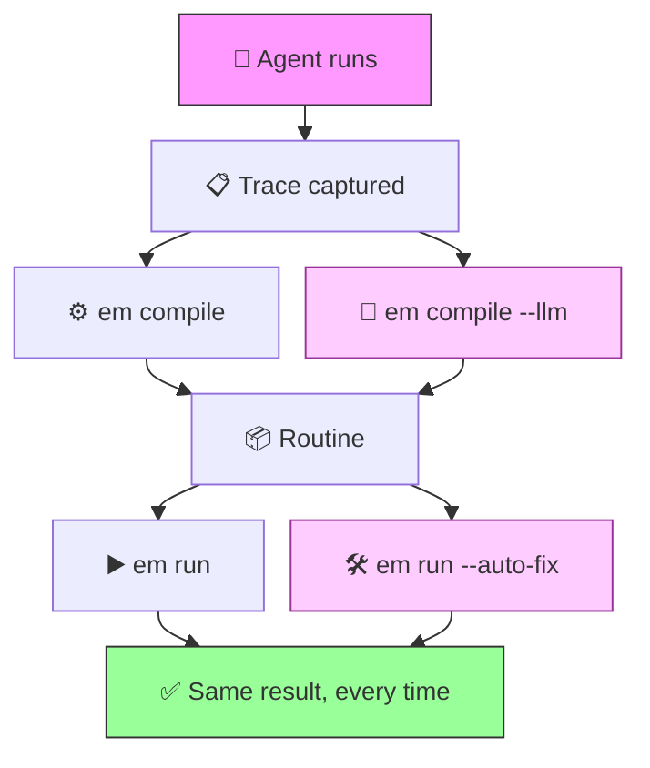

# Executable Memory

> Your agent solved it yesterday. Today it picked a different path, burned twice the tokens, and got a worse result.

**Executable Memory** captures successful agent traces and compiles them into deterministic routines — replayable YAML + Python that run without LLM calls. Optionally, an LLM can **smart-compile** messy traces (removing errors, retries, dead-ends) and **auto-fix** runtime failures.



## Before / After

|  | Without EM | With EM | With EM + LLM |
|--|-----------|---------|---------------|
| LLM calls per run | 5–50 | **0** | **0** (1 at compile time) |
| Cost per run | $0.02–0.50 | **$0** | **$0** |
| Latency | 5–30s | **<100ms** | **<100ms** |
| Deterministic | No | **Yes** | **Yes** |
| Auditable | Logs only | **Every step in YAML** | **Every step in YAML** |
| Handles messy traces | N/A | Copies 1:1 | **Extracts happy path** |
| Runtime recovery | No | No | **Auto-fix with LLM** |

## Installation

```bash
# Core — no LLM dependencies
pip install em-core

# With LLM support (pick one or both)
pip install em-core[anthropic]
pip install em-core[openai]
pip install em-core[llm]          # both providers
```

## Quickstart (60 seconds)

```python
from em.compiler.compile_trace import compile_trace_file
from em.runner.engine import run_routine

# Compile a trace into a routine
compile_trace_file("trace.json", "./my_routine")

# Run the routine — no LLM needed
result = run_routine("./my_routine", input_data={"url": "https://example.com/data.csv"})
print(result.status)  # "ok"
print(result.output)
```

## CLI

```bash
# Compile a trace into a routine package
em compile trace.json -o ./my_routine

# Compile with LLM intelligence (cleans up errors, retries, dead-ends)
em compile trace.json -o ./my_routine --llm

# Run the compiled routine
em run ./my_routine --input input.json --json

# Run with LLM-powered auto-fix for runtime errors
em run ./my_routine --input input.json --auto-fix

# Validate a routine package
em validate ./my_routine
```

LLM features require an API key:

```bash
# Anthropic (default)
export ANTHROPIC_API_KEY=sk-ant-...

# OpenAI
export EM_LLM_PROVIDER=openai
export OPENAI_API_KEY=sk-...

# Optional: override model
export EM_LLM_MODEL=claude-opus-4-20250514
```

## Integration

```python
from em.runner.engine import run_routine
from em.runner.tools import ToolRegistry

# Register your tools
registry = ToolRegistry()
registry.register("my_tool", my_tool_function)

# Run a routine
result = run_routine(
    routine_dir="path/to/routine",
    input_data={"key": "value"},
    tool_registry=registry,
)

print(result.status)  # "ok", "failed", or "needs_input"
print(result.output)
```

### LLM-powered compilation

```python
from em.llm import get_llm_client
from em.compiler.llm_compile import llm_compile_trace_file

client = get_llm_client()  # reads env vars
llm_compile_trace_file("trace.json", "./my_routine", client)
```

The LLM compiler analyzes the trace, extracts the happy path, removes errors/retries, and generates fully implemented UDFs — unlike the deterministic compiler which copies the trace 1:1 and produces stubs.

### Runtime auto-fix

```python
from em.llm import get_llm_client
from em.llm._recovery import make_auto_fix_fn
from em.runner.engine import run_routine

client = get_llm_client()
fix_fn = make_auto_fix_fn(client)

result = run_routine(
    routine_dir="./my_routine",
    input_data={"key": "value"},
    auto_fix_fn=fix_fn,
)
```

When a step fails, the auto-fix callback sends the error context to the LLM, which returns one of three strategies:
- **modify_args** — retry the step with corrected arguments (max 1 retry)
- **skip** — skip the step and use a default value
- **fail** — no recovery possible, propagate the error

## How it works

1. **Trace** — JSON recording of what an agent did: tool calls, UDF calls, approval steps
2. **Compile** — `em compile` converts the trace into a YAML routine + Python UDFs
   - Deterministic mode (default): copies the trace 1:1, generates UDF stubs
   - LLM mode (`--llm`): extracts the happy path, produces implemented UDFs
3. **Run** — `em run` replays the routine deterministically, step by step
   - With `--auto-fix`: LLM assists when steps fail (modify args, skip, or fail)
4. **Validate** — `em validate` checks that a routine package is well-formed

Routine steps: `tool.call`, `udf.call`, `assert`, `prompt.user`, `return`

## Project structure

```
packages/
  em-core/
    em/
      compiler/     # Trace → routine (deterministic + LLM)
      runner/       # Step execution engine
      llm/          # Provider-agnostic LLM abstraction
      models/       # Pydantic models (Trace, Routine, Results)
      utils/        # YAML I/O, schemas, hashing
    tests/          # 88 tests (all mocked, no API keys needed)
examples/
  csv_report/       # Complete working example
```

## Links

- [Documentation](docs/)

## License

[MIT](LICENSE)
