# Executable Memory

> Your agent solved it yesterday. Today it picked a different path, burned twice the tokens, and got a worse result.

**Executable Memory** captures successful agent traces and compiles them into deterministic routines — replayable YAML + Python that run without LLM calls.

```mermaid
---
config:
  themeVariables:
    fontSize: 14px
  flowchart:
    padding: 15
    nodeSpacing: 15
    rankSpacing: 20
---
graph TB
    A["🤖 Agent runs"] --> B["📋 Trace captured"]
    B --> C["⚙️ em compile"]
    C --> D["📦 Routine"]
    D --> E["▶️ em run"]
    E --> F["✅ Same result, every time"]
    style A fill:#f9f,stroke:#333
    style F fill:#9f9,stroke:#333
```



## Before / After

|  | Without EM | With EM |
|--|-----------|---------|
| LLM calls per run | 5–50 | **0** |
| Cost per run | $0.02–0.50 | **$0** |
| Latency | 5–30s | **<100ms** |
| Deterministic | No | **Yes** |
| Auditable | Logs only | **Every step in YAML** |

## Quickstart (60 seconds)

```bash
pip install em-core
```

```python
from em.compiler.compile import compile_trace
from em.runner.engine import run_routine
import json, tempfile

# Compile a trace into a routine
trace = json.load(open("trace.json"))
out = tempfile.mkdtemp()
compile_trace(trace, out)

# Run the routine — no LLM needed
result = run_routine(out, input_data={"url": "https://example.com/data.csv"})
print(result.status)  # "ok"
print(result.output)
```

## CLI

```bash
# Compile a trace into a routine package
em compile trace.json -o ./my_routine

# Run the compiled routine
em run ./my_routine --input input.json --json

# Validate a routine package
em validate ./my_routine
```

## Integration

```python
from em.runner.engine import run_routine
from em.runner.tools import ToolRegistry

# Register your tools
registry = ToolRegistry()
registry.register("my_tool", my_tool_function)

# Run a routine
result = run_routine(
    routine_dir="path/to/routine",
    input_data={"key": "value"},
    tool_registry=registry,
)

print(result.status)  # "ok", "failed", or "needs_input"
print(result.output)
```

## How it works

1. **Trace** — JSON recording of what an agent did: tool calls, UDF calls, approval steps
2. **Compile** — `em compile` converts the trace into a YAML routine + Python UDFs
3. **Run** — `em run` replays the routine deterministically, step by step
4. **Validate** — `em validate` checks that a routine package is well-formed

Routine steps: `tool.call`, `udf.call`, `assert`, `prompt.user`, `return`

## Project structure

```
packages/
  em-core/          # Python package — models, compiler, runner, CLI
  em-web/           # Next.js demo playground
examples/
  csv_report/       # Complete working example
```

## Links

- [Documentation](docs/)
- [Web Demo](packages/em-web/)
- [Contributing](CONTRIBUTING.md)

## License

[MIT](LICENSE)
